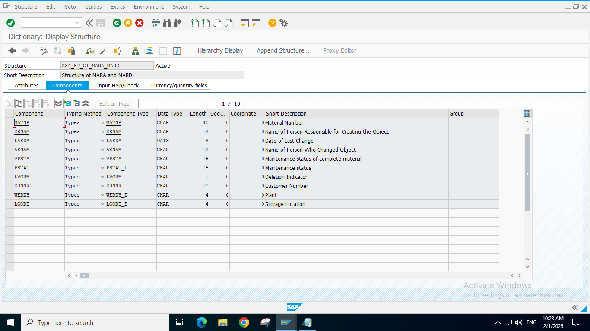
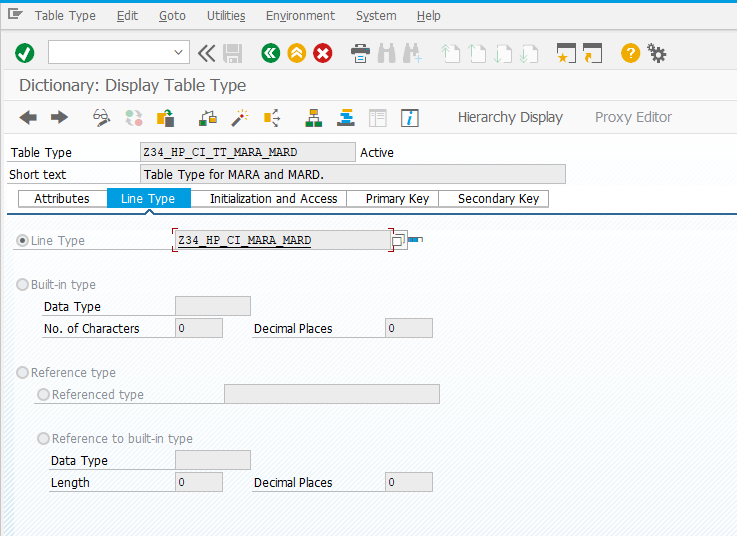
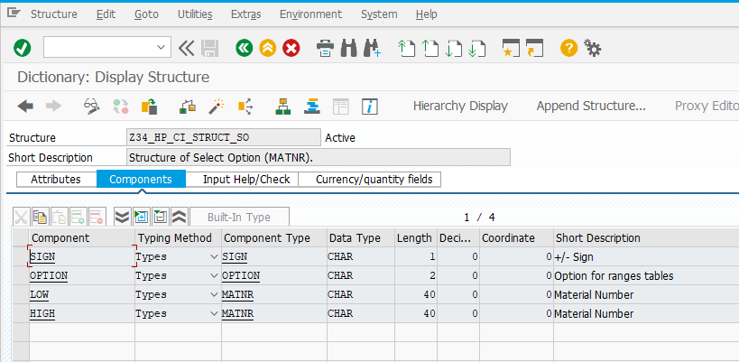
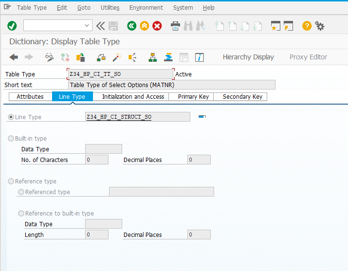
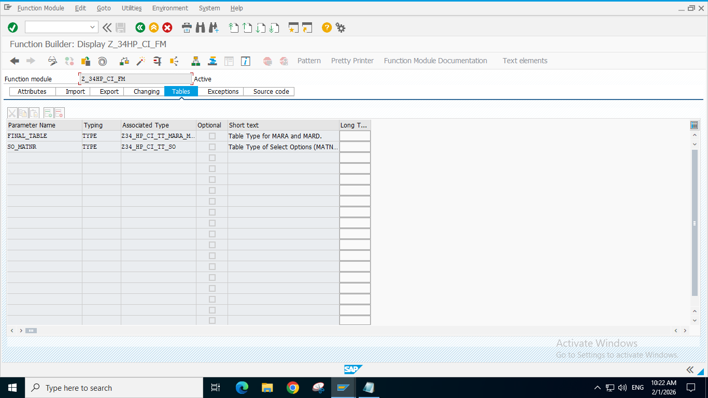

# M1 Assessment - MOCK Practice 💻

> Create a Report and make the Include Programs for T(Data) S(Selection) F(Subroutine), in the respective order.

### Structure of Join Required [MARA and MARD].

### Table Type of Join Required [MARA and MARD].

### Structure for Select Options [Material Number Range].

### Table Type for Select Options [Material Number Range].

### Function Module - Tables Tab.

> Now write the Source Code required in the Function Module. Refer to file "Z_34HP_CI_FM".

> The created Report must now be constructed with requirements provided. Refer to "Z34HOMEPRACT_CI_T", "Z34HOMEPRACT_CI_T", "Z34HOMEPRACT_CI_S", "Z34HOMEPRACT_CI_F".